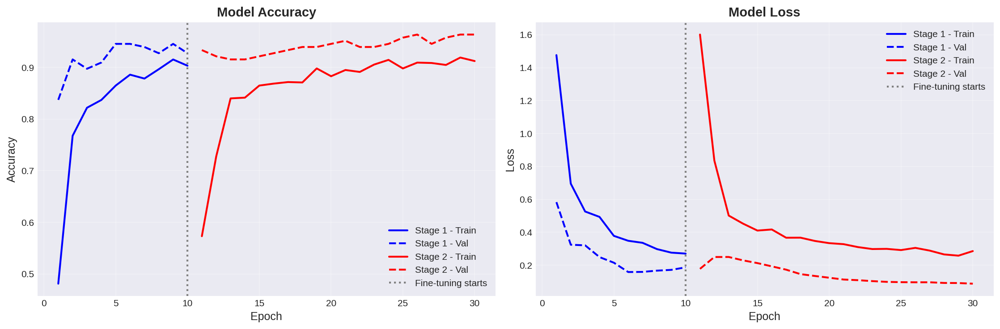
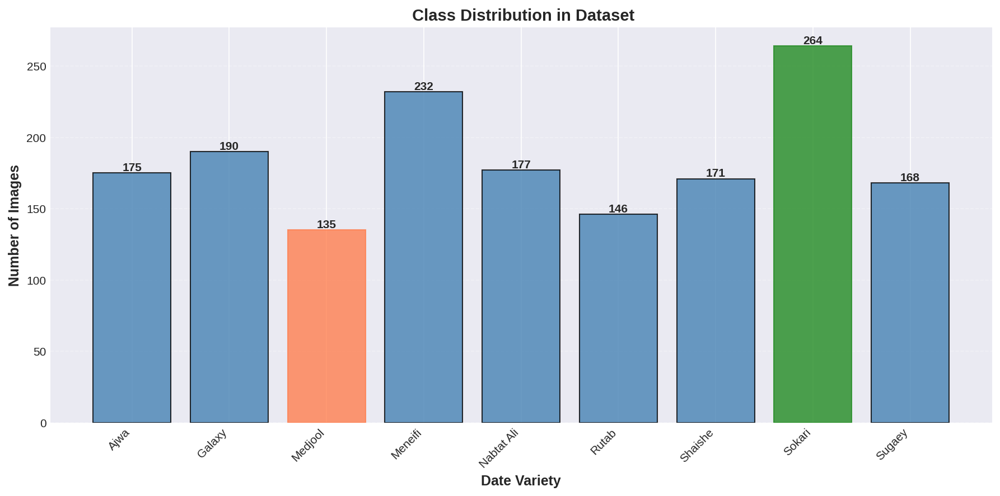
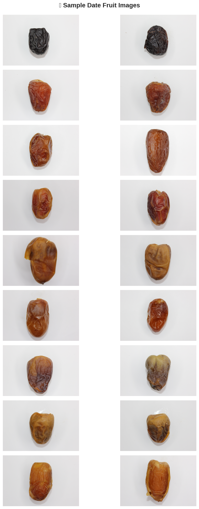
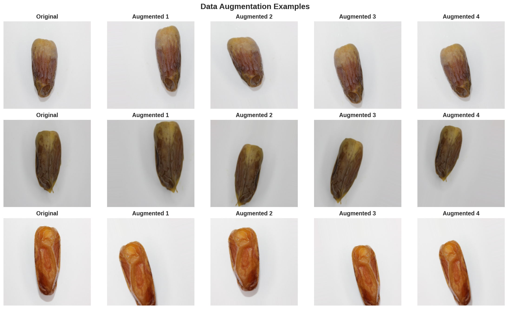
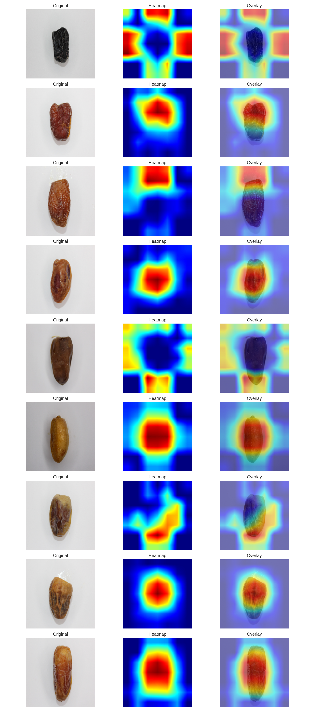
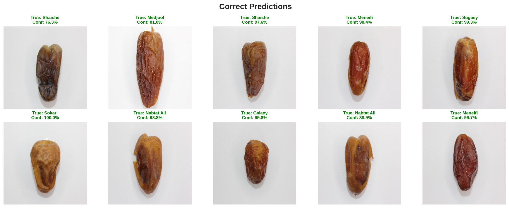
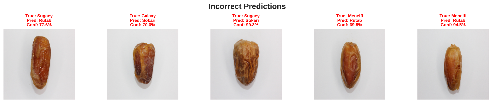
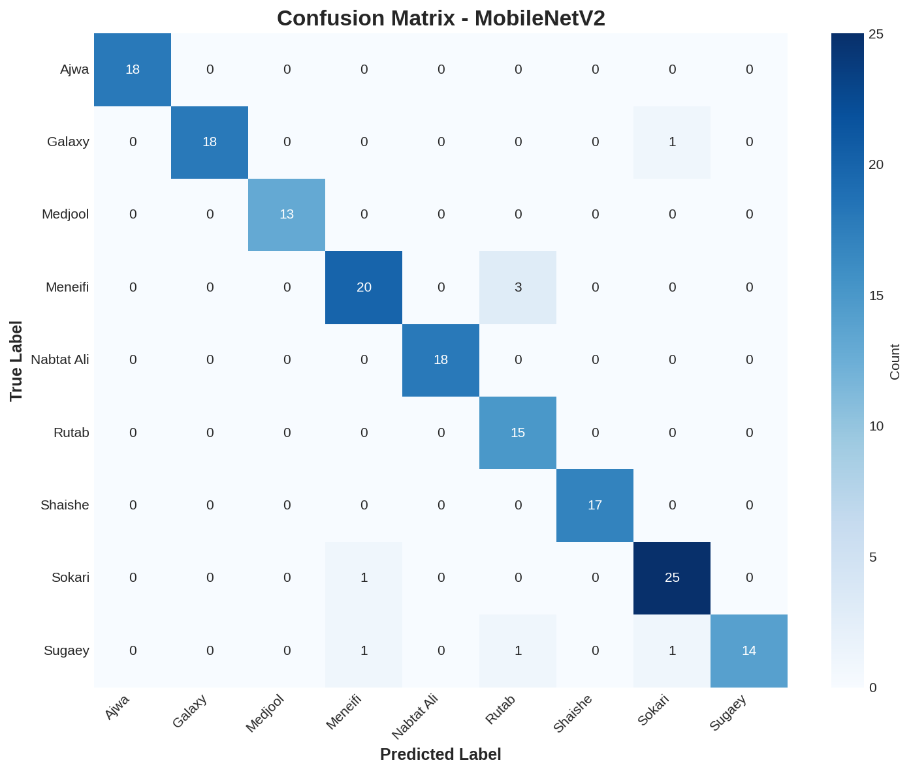

# 🌴 High-Accuracy Date Fruit Classification
### MobileNetV2 + Grad-CAM | 9-Class Agricultural Classification


> A lightweight MobileNetV2-based classification system for 9 date fruit varieties — achieving **95.18% test accuracy** with 96ms inference, Grad-CAM explainability, and a 24.7MB model ready for mobile and edge deployment.

---

## 📋 Table of Contents

- [Overview](#-overview)
- [Results at a Glance](#-results-at-a-glance)
- [Dataset](#-dataset)
- [Model Architecture](#-model-architecture)
- [Two-Stage Training Strategy](#-two-stage-training-strategy)
- [Grad-CAM Explainability](#-grad-cam-explainability)
- [Project Structure](#-project-structure)
- [Setup & Usage](#-setup--usage)
- [Error Analysis](#-error-analysis)
- [Future Work](#-future-work)
- [Authors](#-authors)
- [References](#-references)

---

## 🔭 Overview

Manual classification of date fruits is time-consuming and error-prone at industrial scales, particularly when varieties share similar visual characteristics. This project builds an accurate yet lightweight classification system using **MobileNetV2 transfer learning**, designed for real-world agricultural deployment on mobile devices and edge computing platforms.

The system classifies **9 commercial date varieties** from images captured under standardized conditions, using a **two-stage training strategy** — frozen backbone for rapid head training, followed by partial fine-tuning of the final 40 layers.

Grad-CAM explainability overlays show exactly which regions of the fruit the model attends to, making the system interpretable for agricultural operators.

---

## 🏆 Results at a Glance

| Metric | Value |
|---|---|
| **Test Accuracy** | **95.18%** |
| Precision | 95.68% |
| Recall | 95.18% |
| F1-Score | 95.21% |
| Inference Time | 96.68 ms/image |
| Throughput | ~10.3 images/second |
| Model Size | **24.79 MB** |
| Parameters | ~2.62M trainable |

> 📊 **Training Curves**
>
> 

---

## 📦 Dataset

- **Source:** [Date Fruit Image Dataset in Controlled Environment](https://www.kaggle.com/datasets/wadhasnalhamdan/date-fruit-image-dataset-in-controlled-environment) (Kaggle — wadhasnalhamdan)
- **Total Images:** 1,658 high-quality images in controlled lighting
- **Split:** 1,326 train / 166 validation / 166 test (80-10-10)
- **Input size:** 224×224 pixels (RGB)
- **Random seed:** 42

### 9 Date Varieties

| Variety | Characteristics |
|---|---|
| Ajwa | Dark, almost black; distinctive wrinkled texture |
| Galaxy | Medium-sized with characteristic surface patterns |
| Medjool | Large, amber-colored; prized for sweetness |
| Meneifi | Elongated with smooth skin |
| Nabtat Ali | Medium-sized with unique coloration |
| Rutab | Semi-ripe; softer texture |
| Shaishe | Small to medium with specific visual markers |
| Sokari | Golden-yellow; firm texture |
| Sugaey | Characteristic shape and color profile |

> 📊 **Class Distribution & Sample Images**
>
> | Class Distribution | Sample Images |
> |---|---|
> |  |  |

### Data Augmentation

| Split | Transforms |
|---|---|
| Train | RandomRotation(20°), WidthShift(0.2), HeightShift(0.2), Zoom(0.15), HorizontalFlip, BrightnessRange([0.9, 1.1]) |
| Val / Test | No augmentation |

> 

---

## 🧠 Model Architecture

MobileNetV2 pretrained on ImageNet with a custom classification head:

```
Input (224×224×3)
    │
    ▼
MobileNetV2 Base (ImageNet pretrained)
    │  Inverted residual blocks + depthwise separable convolutions
    │  Stage 1: Frozen | Stage 2: Last 40 layers unfrozen
    ▼
Global Average Pooling
    ▼
Dense (ReLU activation)
    ▼
Dropout (regularization)
    ▼
Dense(9) + Softmax  →  9-class probability output
```

**Why MobileNetV2?**
- Inverted residual structures with linear bottlenecks — better accuracy/efficiency tradeoff than V1
- Designed specifically for mobile and edge deployment
- Proven strong transfer learning baseline for specialized visual tasks

---

## 🔁 Two-Stage Training Strategy

```
Stage 1 (10 epochs)   →   Frozen base, train head only    LR = 1e-3
Stage 2 (20 epochs)   →   Unfreeze last 40 layers          LR = 1e-5
```

| Stage | Val Accuracy | Notes |
|---|---|---|
| Stage 1 (end) | 94.58% | Head trained on frozen ImageNet features |
| Stage 2 (end) | 96.39% | Fine-tuned last 40 layers for date-specific patterns |
| **Test set** | **95.18%** | Final evaluation on held-out data |

**Optimizer:** Adam
**Loss:** Categorical cross-entropy
**Callbacks:** ModelCheckpoint, EarlyStopping, ReduceLROnPlateau

Three model checkpoints are saved:
- `mobilenetv2_stage1_best.keras` — best Stage 1 checkpoint
- `mobilenetv2_stage2_best.keras` — best Stage 2 checkpoint
- `mobilenetv2_final.keras` — final trained model

---

## 🗺️ Grad-CAM Explainability

Grad-CAM (Gradient-weighted Class Activation Mapping) highlights which regions of the input image most influenced the model's prediction. Applied to the last convolutional layer of MobileNetV2.

- ✅ **Correct predictions:** Heatmaps consistently focus on the fruit body — specifically texture, color gradients, and surface shape
- ❌ **Incorrect predictions:** Attention drifts to background areas or shared features between visually similar varieties (Rutab vs. Meneifi)

> 

> | Correct Predictions | Incorrect Predictions |
> |---|---|
> |  |  |

---

## 📁 Project Structure

```
date-fruit-classification/
│
├── README.md
├── requirements.txt
├── .gitignore
├── LICENSE
│
├── Date_Fruit_Classification.ipynb     # Full pipeline — EDA, training, evaluation, Grad-CAM
│
├── model/                              # Saved model checkpoints
│   ├── mobilenetv2_final.keras
│   ├── mobilenetv2_stage1_best.keras
│   └── mobilenetv2_stage2_best.keras
│
├── results/
│   ├── project_summary.txt            # Training summary and metrics
│   ├── test_results.json              # Per-class test results
│   └── plots/                         # All generated figures
│       ├── sample_images.png
│       ├── class_distribution.png
│       ├── augmentation_examples.png
│       ├── training_curves.png
│       ├── confusion_matrix.png
│       ├── correct_predictions.png
│       ├── incorrect_predictions.png
│       └── gradcam_all_classes.png
│
└── docs/
    └── High-Accuracy_Date_Fruit_Classification_Report.docx
```

---

## ⚙️ Setup & Usage

### 1. Open in Google Colab

Upload `Date_Fruit_Classification.ipynb` to [colab.research.google.com](https://colab.research.google.com).

### 2. Set up Kaggle credentials

In Colab Cell 2, you'll be prompted to upload your `kaggle.json` file.
Get it from: [kaggle.com/settings/account](https://www.kaggle.com/settings/account) → API → **Create New Token**

### 3. Run all cells in order

```
Runtime → Run all  (Ctrl+F9)
```

The notebook will automatically:
- Download and extract the dataset
- Run EDA and visualize class distribution
- Build and train the MobileNetV2 model (Stage 1 + Stage 2)
- Evaluate on the test set
- Generate Grad-CAM heatmaps
- Save all plots and model checkpoints

### 4. Use a saved model

```python
from tensorflow.keras.models import load_model
import numpy as np, cv2

model = load_model('model/mobilenetv2_final.keras')

img = cv2.imread('your_image.jpg')
img = cv2.cvtColor(img, cv2.COLOR_BGR2RGB)
img = cv2.resize(img, (224, 224)) / 255.0
img = np.expand_dims(img, axis=0)

predictions = model.predict(img)
class_names = ['Ajwa', 'Galaxy', 'Medjool', 'Meneifi',
               'Nabtat Ali', 'Rutab', 'Shaishe', 'Sokari', 'Sugaey']
print(f"Predicted: {class_names[np.argmax(predictions)]}")
```

---

## 🔬 Error Analysis

The confusion matrix reveals two key patterns:

**Strong performance:** Ajwa (dark, wrinkled) and Medjool (large, amber) are nearly perfectly classified due to distinctive visual characteristics.

**Primary confusion:** Rutab and Meneifi share similar elongated shapes and overlapping color profiles in semi-ripe states — the same challenge human inspectors face, suggesting the model has learned the same discriminative features.

> 

---

## 🔮 Future Work

- **Dataset expansion** — incorporate images under varying lighting, backgrounds, and camera angles for real-field robustness
- **Hardware deployment** — benchmark on Raspberry Pi, NVIDIA Jetson Nano, and mobile devices
- **Model compression** — apply 8-bit quantization via TensorFlow Lite to reduce size further
- **Object detection** — extend to fruit localization for automated sorting pipelines
- **Mobile app** — build an intuitive UI for field use by individual farmers

---

## 👥 Authors

7th Semester Minor Project — **KIIT University, Bhubaneswar, Odisha**

| Name | Email |
|---|---|
| **Prabhupada Samantaray** | psray313@gmail.com |
| **Aradhana Behura** *(Guide)* | aradhana.behurafcs@kiit.ac.in |

---

## 📚 References

- Albarrak et al. (2022) — Deep learning-based model for date fruit classification. *Sustainability* 14(10).
- Almomen et al. (2023) — Date fruit classification based on surface quality using CNN. *Applied Sciences* 13(13).
- Koklu et al. (2021) — Classification of date fruits into genetic varieties using image analysis. *Mathematical Problems in Engineering*.
- Altaheri et al. (2019) — Date fruit classification for robotic harvesting using deep learning. *IEEE Access* 7.
- Fahim et al. (2024) — MobileNetV2: A proficient CNN for classification of date fruits. *International Conference on Machine Learning Algorithms*.

---

## 📄 License

This project is licensed under the [MIT License](./LICENSE).
